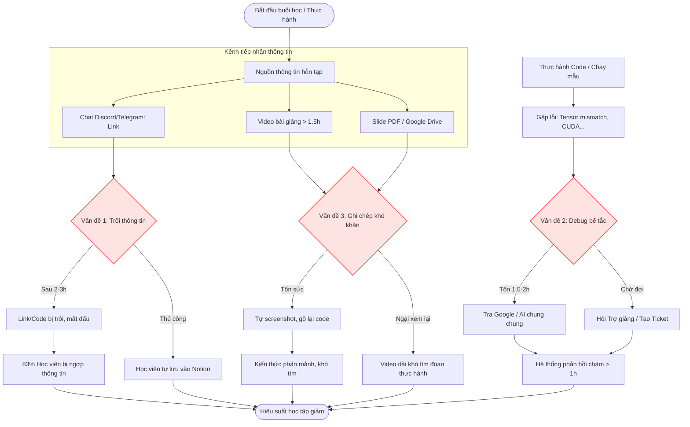
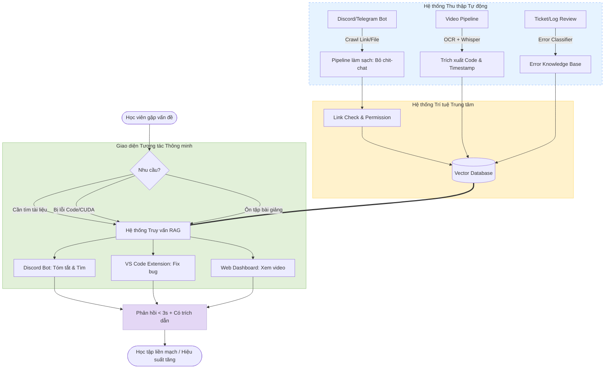

# Group Report — Day 02

## Thành viên nhóm

| STT | Họ và tên | Mã học viên | Vai trò trong nhóm |
|-----|-----------|-------------|--------------------|
| 1   | Nguyễn Văn Dương        |      01400       |          Trưởng nhóm          |
| 2   |  Sái Hoài Nam           |         01993    |         Thành viên           |
| 3   |     Giáp Hoàng Thịnh    |         01492    |        Thành viên            |
| 4   |         Nguyễn Văn Tấn  |      01246       |       Thành viên             |
| 5   |    Lăng Nhật Minh       |        01482     |            Thành viên        |

# Phase 3 — Group Convergence: từ 12 candidates về 1 (30')

## Bước 3.1 — Trình bày top 3 của các thành viên
Các thành viên trong nhóm lần lượt trình bày các vấn đề cốt lõi mà mình đã thu thập được.

| # | Người đưa ra | Đề tài (Candidate problem) | Người gặp vấn đề (Actor) | Điểm nghẽn (Bottleneck) | Cảm nhận nhanh của nhóm |
|---|---|---|---|---|---|
| 1 | **Nguyễn Văn Tấn** | Tham lam học nhiều công nghệ cùng lúc dẫn đến quá tải. | Người tự học / Sinh viên IT. | Không biết điểm dừng, sa lầy vào việc học tool thay vì làm ra sản phẩm. | Nỗi đau thật, nhưng thiên về vấn đề tâm lý (FOMO) và kỷ luật cá nhân hơn là bài toán cho AI. |
| 2 | **Nguyễn Văn Tấn** | **Thiếu Mentor (Người hướng dẫn) để gỡ lỗi.** | Học viên làm dự án AI thực tế. | Mắc kẹt hàng giờ với các log lỗi phần cứng/môi trường mà không biết hỏi ai. | **Rất đau.** Phù hợp làm AI Agent hỗ trợ debug (AI Mentor). |
| 3 | **Nguyễn Văn Tấn** | Máy tính không đủ mạnh để huấn luyện mô hình. | Sinh viên không có GPU mạnh. | Thời gian train model quá lâu, rào cản vật lý rõ ràng. | Khó dùng AI để giải quyết triệt để phần cứng, rủi ro giảm accuracy cao. |
| 4 | **Sái Hoài Nam** | **Tìm kiếm và tổng hợp tài liệu domain AI Project.** | Học viên / Researcher AI. | Tốn 30-60 phút tra cứu Google/GitHub/ArXiv mỗi lần cần tìm context. | **Cực kỳ phổ biến.** Rất phù hợp làm hệ thống RAG / Search Agent. |
| 5 | **Sái Hoài Nam** | **Tóm tắt tài liệu PDF/Video dài thành ý trọng tâm.** | Sinh viên / Team chạy project. | Tốn nhiều thời gian đọc tài liệu gốc dài dòng mà trôi tuột kiến thức. | Rất thiết thực, dễ làm MVP và đo lường thời gian tiết kiệm được. |
| 6 | **Sái Hoài Nam** | Quản lý deadline nhiều lab và project. | Sinh viên chạy nhiều deadline. | Xảy ra hàng ngày, dễ trễ hạn gây ảnh hưởng tiến độ chung. | Khó cạnh tranh với các tool có sẵn như Notion, Trello, Jira. |
| 7 | **Lăng Nhật Minh** | Cân đối lịch trình tập luyện thể thao phức hợp. | Người tập thể thao bán chuyên. | Mất thời gian xếp lịch thủ công hàng tuần. | Khó lượng hóa chính xác dữ liệu đầu vào (mức độ mệt mỏi vật lý). |
| 8 | **Lăng Nhật Minh** | Xử lý Merge Conflict khi làm việc nhóm trên Git. | Developer / Team code chung. | Mất hàng chục phút đọc hiểu logic code của người khác để gộp lại. | Rủi ro sinh lỗi logic ngầm rất cao nếu để AI tự động Auto-merge. |
| 9 | **Lăng Nhật Minh** | Đứt gãy trải nghiệm khi tra cứu Wiki game/app. | Gamer / Mobile User. | Thao tác chuyển đổi app (Alt+Tab / vuốt màn hình) liên tục. | Nhu cầu hẹp, cấu hình mobile có thể không gánh nổi AI Vision chạy ngầm. |
| 10 | **Giáp Hoàng Thịnh** | Nhập số liệu báo cáo thủ công. | Nhân viên văn phòng. | Lặp lại cơ học, tốn thời gian nhất trong ngày. | Thiết thực nhưng phụ thuộc vào form báo cáo đặc thù của từng cty. |
| 11 | **Giáp Hoàng Thịnh** | Nghĩ Title và Keyword SEO. | Content Creator / Marketer. | Cạn ý tưởng, áp lực sau khi viết xong kịch bản dài. | Dễ làm bằng Prompt/LLM cơ bản, không cần đến Agent hay hệ thống phức tạp. |
| 12 | **Giáp Hoàng Thịnh** | Báo cáo dài, CEO duyệt chậm. | Quản lý cấp trung. | Nút thắt cổ chai làm nghẽn toàn bộ tiến độ dự án. | Vấn đề nằm ở style quản lý (Micro-management) của CEO hơn là do độ dài văn bản. |
| 13 | **Nguyễn Văn Dương**| Rà soát rủi ro và các "bẫy" điều khoản trong hợp đồng thuê nhà trọ. | Sinh viên mới ra trường tìm phòng trọ. | Hợp đồng thuê nhà thường dài dòng, chứa nhiều thuật ngữ pháp lý khó hiểu; sinh viên dễ mất tiền cọc. | Thiết thực với sinh viên, nhưng liệu chủ trọ có sẵn sàng đàm phán sửa đổi hay chỉ cho "thuê hay bỏ"? |
| 14 | **Nguyễn Văn Dương**| Tự động tóm tắt và hệ thống hóa ghi chú từ video bài giảng kỹ năng dài. | Người tự học online qua video. | Việc tự học qua video bài giảng (30p+) tốn nhiều thời gian vừa xem vừa dừng để ghi chép thủ công. | Trùng khớp với ý tưởng số 5. Tuy nhiên cần xem xét chất lượng transcript tiếng Việt có đủ tốt để tóm tắt không. |
| 15 | **Nguyễn Văn Dương**| Tính toán và phân chia chi phí sinh hoạt hàng tháng ở ghép. | Sinh viên ở ghép cùng phòng trọ. | Lặp lại hàng tháng, tốn thời gian cộng trừ thủ công và rất nhạy cảm khi nhắc nợ. | Bài toán này có thực sự cần đến AI không, hay chỉ cần một file Excel (Rule-based) là đủ? |
---

## Bước 3.2 — Gom trùng / phân cụm (Cluster)
Nhóm tiến hành phân loại 15 đề tài trên để tìm ra các cụm vấn đề có sự liên kết chặt chẽ với nhau.

| Cluster | Candidates included (Các đề tài thuộc cụm) | Pattern chung của cụm | Ghi chú |
|---|---|---|---|
| **A. Hệ thống hóa tri thức & Trợ lý học tập** | Đề tài 2 (Thiếu Mentor), Đề tài 4 (Tìm tài liệu AI), Đề tài 5 & 14 (Tóm tắt PDF/Video bài giảng). | Đều là nỗi đau lớn nhất của học viên/sinh viên khi làm Lab/Project AI: Ngợp tài liệu, mất thời gian tra cứu, lười ghi chép và bế tắc khi debug. | **Rất tiềm năng.** Có thể gộp chung lại thành một hệ thống "AI Copilot cho khóa học AI" giải quyết toàn diện việc tra cứu và sửa lỗi. |
| **B. Tự động hóa tác vụ văn phòng** | Đề tài 10 (Nhập liệu báo cáo), Đề tài 12 (Tóm tắt báo cáo cho CEO). | Giải phóng con người khỏi các tác vụ lặp lại, đọc và điền form số liệu. | Bài toán B2B kinh điển, nhưng nhóm khó tiếp cận dữ liệu thật của doanh nghiệp để làm Lab. |
| **C. Hỗ trợ kỹ thuật chuyên sâu (DevTools)** | Đề tài 3 (Phần cứng yếu), Đề tài 8 (Merge Git conflict). | Đụng chạm sâu vào hạ tầng phần cứng hoặc logic source code. | Rủi ro kỹ thuật cao, ranh giới AI tự động và con người can thiệp rất mong manh. |
| **D. Đời sống & Cá nhân** | Đề tài 1, 6, 7, 9, 11, 13 (Hợp đồng thuê nhà), 15 (Chia tiền trọ). | Giải quyết nhu cầu cá nhân đơn lẻ, thường đã có app hỗ trợ hoặc dễ dàng xử lý bằng Rule-based/Excel cơ bản. | Phân tán, tác động (Impact) mang tính cá nhân, khó triển khai thành hệ thống lớn. |

---

## Bước 3.3 — Shortlist
Nhóm thống nhất loại bỏ các cụm B, C, D vì dữ liệu khó tiếp cận hoặc giải pháp Non-AI (Rule-based) đã giải quyết quá tốt (như việc chia tiền trọ). Nhóm chọn ra 3 ý tưởng tốt nhất từ Cụm A (Học tập & Nghiên cứu AI) để đưa vào vòng chấm điểm.

| Candidate | Vì sao vào shortlist | Rủi ro / Điều chưa rõ |
|---|---|---|
| **1. Hệ thống tìm kiếm và tổng hợp tài liệu (Slide, Code, Link) cho dự án AI.** | Nỗi đau diễn ra thường xuyên (mất 30-60p mỗi lần). Rất phù hợp để áp dụng RAG/Vector DB. Cả nhóm đều đang trải nghiệm nỗi đau này. | Cần xác minh nguồn dữ liệu (như link Discord trôi) nào thực sự mang lại giá trị. |
| **2. Trợ lý Mentor AI phân tích log lỗi và hỗ trợ debug.** | Giải quyết nút thắt lớn nhất khi làm dự án thực tế. Tránh việc chờ đợi TA quá lâu. Định lượng được thời gian tiết kiệm rõ rệt. | AI có thể bị "ảo giác" (hallucination) hoặc không nắm được 100% bối cảnh môi trường phần cứng. |
| **3. Tự động tóm tắt PDF/Video dài thành các ý trọng tâm.** | (Tổng hợp từ ý tưởng số 5 & 14). Dễ xây dựng MVP, workflow rõ ràng. Khắc phục tình trạng lười ghi chép và kiến thức bị phân mảnh. | Cần kiểm chứng chất lượng transcript tiếng Việt có đủ tốt và học viên có thực sự dùng bản tóm tắt không. |

---

## Bước 3.4 — Chấm điểm để đồng thuận (Scoring)
Để tạo ra một sản phẩm có tính ứng dụng cao nhất, nhóm quyết định chấm điểm để xem nên tập trung vào bài toán nào, hoặc liệu có thể **gộp chúng lại thành một hệ thống tổng thể** hay không.

| Tiêu chí đánh giá | Đề tài 1: Tìm kiếm & Tổng hợp tài liệu | Đề tài 2: Trợ lý AI Mentor Debug | Đề tài 3: Tóm tắt PDF/Video |
|---|:---:|:---:|:---:|
| **Actor rõ cụ thể** | 5 | 5 | 5 |
| **Workflow rõ ràng** | 5 | 4 | 4 |
| **Nỗi đau có bằng chứng (Evidence)** | 5 | 5 | 4 |
| **Tác động đo lường được (Impact)** | 5 | 5 | 4 |
| **Khả thi thực hiện trong lab** | 5 | 4 | 4 |
| **So sánh được Rule/Workflow/Agent** | 5 | 5 | 4 |
| **Nhóm hiểu sâu về lĩnh vực (Domain)** | 5 | 5 | 5 |
| **TỔNG ĐIỂM** | **35** | **33** | **30** |

### Quyết định cuối cùng của nhóm:
Điểm số của Đề tài 1 và Đề tài 2 rất sát sao và thực chất, chúng bổ trợ hoàn hảo cho nhau trong quá trình học tập. Nhóm đi đến quyết định **GO** với một bài toán tổng hợp mang tên: 

**"Hệ thống hóa tài liệu học tập và hỗ trợ Mentor Debug thông minh cho học viên AI thực chiến".**

* **Lý do:** 
    1. Bài toán giải quyết trọn vẹn cả 3 vấn đề lớn nhất của nhóm: ngợp tài liệu (Đề tài 1), bế tắc khi debug (Đề tài 2) và lười ghi chép video dài (Đề tài 3/14).
    2. Workflow và Metric cực kỳ rõ ràng (có thể đo đếm bằng thời gian tra cứu và số lượng ticket trợ giảng phải giải quyết).
    3. Việc kết hợp tạo ra cơ hội thiết kế một kiến trúc **Agentic Workflow** toàn diện.

# Phase 4 — Validation + Research 

## Bước 4.1 — Báo cáo Dữ liệu Khảo sát (Validation)
Nhóm đã tiến hành thu thập dữ liệu thực tế từ lớp học AI thực chiến để xác minh xem các vấn đề đã chọn có thực sự là nỗi đau lớn và đáng để giải quyết hay không.

| Nguồn | Số người / số mẫu | Tín hiệu xác nhận (Signals) | Tín hiệu phản bác (Pushbacks) | Nhóm sửa problem thế nào |
|---|---:|---|---|---|
| **Interview (Phỏng vấn)** | 3 học viên (2 tự học, 1 học qua bootcamp) & 1 trợ giảng | • **Vấn đề 1:** Mất tài liệu, link Colab, code repo quan trọng vì trôi nhanh sau 2-3 giờ trong nhóm chat Discord/Telegram. • **Vấn đề 2:** Tốn trung bình 1.5 đến 2 giờ chỉ để debug các lỗi tensor mismatch (PyTorch) hoặc sai phiên bản CUDA. • **Vấn đề 3:** Lười ghi chép video dài (>1.5 tiếng) và khó bóc tách các đoạn code demo thực hành. | • Một số học viên có thói quen tự bookmark link vào Notion cá nhân nên ít phụ thuộc vào công cụ tìm kiếm của nhóm. • Có ý kiến cho rằng lỗi code đôi khi đọc stack trace quen thì tự sửa nhanh hơn dùng AI gợi ý chung chung. | • Xây dựng tính năng **Auto-Pin & Summary Bot** cho kênh chat để tự động gom link, slide. • Xây dựng **Error Classifier** tập trung sâu vào các lỗi framework phổ biến (PyTorch, YOLO, OpenCV) thay vì dàn trải. • Tích hợp công cụ trích xuất timestamp và code snippet từ video bài giảng. |
| **Survey / Poll (Khảo sát)** | 12 phản hồi từ Discord poll lớp AI thực chiến | • **83%** gặp tình trạng "ngợp" thông tin, khó tìm lại tài liệu cũ sau 1 tuần học. • **91%** coi việc debug lỗi thư viện (chạy code mẫu bị lệch phiên bản) là điểm nghẽn lớn nhất. • **75%** mong muốn có hệ thống tự động tóm tắt video kèm mốc thời gian thực hành. | • Khoảng 25% học viên cho biết họ chủ yếu hỏi trực tiếp trợ giảng thay vì tra cứu hệ thống tự động nếu hệ thống trả kết quả chậm hơn 10 giây. • Một phần nhỏ học viên dùng các công cụ ghi chú có sẵn (Obsidian) và ngại chuyển đổi nền tảng. | • Đặt mục tiêu tích hợp hệ thống trực tiếp vào **Discord Bot** và **VS Code Extension** để học viên không phải chuyển đổi tab hay học cách dùng giao diện mới phức tạp. • Ưu tiên tốc độ phản hồi của hệ thống truy vấn tài liệu dưới 3 giây. |
| **Log / Review / Ticket** | 45 tin nhắn hỏi đáp / ticket hỗ trợ trên kênh kỹ thuật (2 tuần gần nhất) | • **60%** câu hỏi lặp lại về cùng một số lỗi môi trường (pip install conflict, CUDA/cuDNN version mismatch). • Các tài liệu dạng slide PDF ít được mở lại sau buổi học trực tiếp, học viên chủ yếu tìm các đoạn code snippet mẫu để chạy thử. • Link tài liệu chia sẻ qua file đính kèm hoặc Google Drive cá nhân thường bị hỏng quyền truy cập (permission denied). | • Các video ngắn (< 15 phút) dạng shorts/reels hướng dẫn sửa lỗi nhanh có tỷ lệ xem lại cao gấp 3 lần video bài giảng dài. • Lịch sử chat cá nhân đôi khi chứa thông tin rác (sticker, chào hỏi) chiếm phần lớn token nếu không được bộ lọc làm sạch trước. | • Thiết lập **Pipeline làm sạch tin nhắn tự động** (chỉ giữ lại các message chứa URL, file code, từ khóa kỹ thuật, bỏ qua chit-chat). • Xây dựng **Error Knowledge Base** dựa trên các ticket lỗi thực tế thay vì crawl tài liệu lý thuyết chung chung. • Tích hợp tính năng kiểm tra tự động trạng thái link (link check) để tránh tình trạng link hỏng. |

---

## Bước 4.2 — Research giải pháp đã có (Competitor Analysis)
Nhóm cũng đã nghiên cứu các công cụ hiện có trên thị trường để tìm ra khoảng trống (gap) và rút ra bài học khi thiết kế hệ thống AI Copilot của mình.

| Nguồn / tool / case | Link tham khảo | Họ giải quyết phần nào? | Điểm mạnh | Khoảng trống / rủi ro | Bài học cho nhóm |
|---|---|---|---|---|---|
| **Google NotebookLM** | [notebooklm.google.com](https://notebooklm.google.com/) | Giải quyết **Vấn đề 1**: Gom nhóm, hệ thống hóa và truy vấn tài liệu (Q&A) từ PDF, slide, web URL, và YouTube. | Sinh câu trả lời dựa trên context (RAG) rất chuẩn xác, luôn có **trích dẫn nguồn (citation)** trỏ về đúng trang tài liệu/slide. Giao diện trực quan. | Không tự động thu thập (crawl) dữ liệu theo thời gian thực từ các kênh chat. Người dùng phải gom và upload tài liệu thủ công. | Bắt buộc hệ thống RAG của nhóm phải có tính năng **hiển thị nguồn trích dẫn** để học viên đối chiếu thông tin. Cần tự động hóa luồng thu thập (ví dụ: Bot Discord tự bắt link) thay vì bắt học viên tự tải lên. |
| **Cursor IDE** | [cursor.com](https://cursor.com/) | Giải quyết **Vấn đề 2**: Tự động giải thích bug và gợi ý sửa lỗi code ngay trong lúc thực hành. | Tích hợp thẳng vào môi trường lập trình (VS Code fork), tự đọc được context từ lỗi trên terminal, log file và các file lân cận. Tốc độ sửa lỗi nhanh (Cmd+K). | Thường trả lời chung chung hoặc đưa ra gợi ý sai khi gặp các bug môi trường phần cứng hẹp (VD: xung đột version CUDA, lỗi tương thích khi export weight YOLO). | Phải đưa AI "đến tận tay" người dùng (thông qua Extension/Plugin) thay vì bắt họ copy lỗi lên web. Error database của nhóm nên tập trung sâu vào các lỗi môi trường AI chuyên biệt mà các tool lớn thường bỏ sót. |
| **NoteGPT** | [notegpt.io](https://notegpt.io/) | Giải quyết **Vấn đề 3**: Hệ thống hóa ghi chú, tóm tắt video bài giảng và trích xuất timestamp. | Lấy transcript YouTube cực nhanh, tự chia các chương (chapters) bài học thông minh, hỗ trợ chụp ảnh màn hình (screenshot) ghi chú đồng bộ với text. | Chỉ xử lý tốt qua Speech-to-Text. Rất khó bóc tách chính xác các đoạn code snippet hoặc link công cụ hiển thị trên màn hình slide của video thành text dạng copy được. | Chỉ dùng âm thanh (Whisper) là không đủ. Pipeline xử lý video của nhóm cần kết hợp thêm **mô hình Vision (OCR)** để "đọc" và trích xuất trực tiếp mã nguồn, câu lệnh cài đặt từ các khung hình (frames) bài giảng. |

# Phase 5 — Workflow + Problem Statement (45')

## 5.1. Sơ đồ quy trình hiện tại (Current Workflow)
Sơ đồ dưới đây mô phỏng chính xác 3 nhánh vấn đề (Trôi thông tin, Debug bế tắc, Ghi chép khó khăn) dẫn đến việc suy giảm hiệu suất học tập của học viên:

## 5.2. Sơ đồ quy trình tương lai có AI (Future Workflow)
Hệ thống AI Copilot sử dụng các đường ống tự động hóa (Pipeline) để thu thập, chuẩn hóa tri thức đa phương thức và cung cấp giao diện tương tác thông minh ngay tại nơi học viên làm việc.

## 5.3. Phương án xử lý lỗi (Fallback Mechanism)
Để đảm bảo trải nghiệm học tập không bị gián đoạn khi AI gặp sự cố:
1. **Trường hợp AI trả lời sai / không tìm thấy link:** Hệ thống tự động gửi kèm một đường link dẫn đến **Thư mục Notion tĩnh** đã được phân loại tài liệu thủ công theo từng tuần học để học viên tự click chọn bằng tay.
2. **Trường hợp AI không sửa được lỗi code (confidence score thấp):** Hệ thống hiển thị nút *"Chuyển tiếp cho TA"*. Khi học viên bấm nút, toàn bộ log lỗi và đoạn hội thoại sẽ được đóng gói tự động thành một Ticket ưu tiên gửi thẳng sang channel riêng của Trợ giảng (TA) người thật để hỗ trợ trực tiếp.

---

## 5.3b. Bảng phát biểu bài toán chính thức (Problem Statement v0)

| Trường thông tin | Nội dung chi tiết |
|---|---|
| **Actor (Người gặp vấn đề)** | Học viên tham gia khóa học AI thực chiến (vừa học vừa làm, bận rộn) và Đội ngũ Trợ giảng (TA). |
| **Workflow (Quy trình)** | Tiếp nhận thông tin đa nguồn -> Thực hành Code -> Gặp lỗi/Cần tìm link cũ -> Tra cứu qua AI Copilot -> Nhận câu trả lời kèm trích dẫn. |
| **Bottleneck (Điểm nghẽn)** | Mất từ 1.5 - 2 giờ để tìm tài liệu trôi hoặc tự debug lỗi môi trường (CUDA, Tensor mismatch); ngại xem lại video dài. |
| **Impact (Tác động)** | 83% học viên bị ngợp thông tin, đứt gãy luồng tư duy, giảm hiệu suất; TA bị quá tải bởi các câu hỏi lặp lại. |
| **Success Metric (Chỉ số)** | Thời gian phản hồi < 3s; Giảm 60% ticket lặp lại cho TA; Tỷ lệ học viên hài lòng và sử dụng bot đạt > 70%. |
| **Boundary (Ranh giới)** | Chỉ xử lý dữ liệu nội bộ khóa học; Không viết code hộ từ đầu; Cung cấp Fallback chuyển sang TA khi AI không tự tin. |

# Phase 6 — Rule / Workflow / Agent + Decision 

## Bước 6.1 — Ma trận độ phù hợp với AI (AI Suitability Matrix)
Nhóm sử dụng ma trận để định vị mức độ phức tạp và mơ hồ của bài toán, từ đó chọn ra giải pháp công nghệ cốt lõi.

| | **Độ mơ hồ thấp (Low Ambiguity)** | **Độ mơ hồ cao (High Ambiguity)** |
|---|---|---|
| **Độ phức tạp thấp (Low Complexity)** | **Rule:** Bot tự động ghim (pin) các tin nhắn có chứa liên kết `drive.google.com` hoặc `github.com`. | **Workflow:** Tự động tóm tắt một đoạn hội thoại hỏi đáp ngắn của học viên và trợ giảng. |
| **Độ phức tạp cao (High Complexity)** | **Workflow:** Pipeline xử lý video bài giảng: Tách âm thanh (Whisper) -> Trích xuất khung hình (OCR) -> Lưu vào Vector DB. | **Agent:** Trợ lý ảo truy vấn tài liệu (RAG) và hỗ trợ suy luận sửa lỗi code dựa trên ngữ cảnh môi trường (CUDA, thư viện). |

**Bài toán của nhóm nằm ở ô nào?**
> Ô **Độ phức tạp cao / Độ mơ hồ cao**.

**Vì sao?**
> 1. **Độ phức tạp cao:** Hệ thống yêu cầu xử lý đa nguồn dữ liệu (Multimodal) từ Chat (text), Video (ảnh/âm thanh), và Slide (PDF). Luồng xử lý gồm nhiều bước nối tiếp nhau (Thu thập -> Làm sạch -> Nhúng dữ liệu -> Truy vấn).
> 2. **Độ mơ hồ cao:** Việc sửa các lỗi như Tensor mismatch hay sai version CUDA không có một công thức duy nhất; nó phụ thuộc vào môi trường, phần cứng và file code cụ thể của từng học viên. Câu trả lời cần sự tổng hợp và suy luận thay vì chỉ trích xuất dữ liệu tĩnh.

---

## Bước 6.2 — So sánh Rule / Workflow / Agent
Dựa trên ma trận, nhóm đưa ra đánh giá 3 phương án để chọn mức độ can thiệp của AI:

| Mức độ | Phương án áp dụng cho bài toán | Khi nào đủ? | Rủi ro | Lựa chọn? |
|---|---|---|---|---|
| **Rule** | Bot dùng Regex tự động quét tin nhắn có từ khóa `#tailieu` hoặc `#error` rồi lưu vào Excel. | Khi chỉ cần quản lý link thô, không cần hiểu nội dung bên trong. | Bỏ sót rất nhiều thông tin (do người dùng quên gõ tag); Hoàn toàn vô dụng trong việc giải thích lỗi code phức tạp. | **Không** |
| **Workflow** | Thiết lập Pipeline tự động cào dữ liệu, chạy Whisper/OCR, lưu vào Database và hiển thị lên Web tổng hợp. | Khi người dùng chỉ cần một kho lưu trữ tài liệu tĩnh để tự tra cứu. | Học viên vẫn mất công mở Web lật tìm thủ công; Chưa giải quyết được việc kẹt cứng (bottleneck) khi đang code trên IDE. | **Có** (Dùng cho khâu đầu vào Ingestion) |
| **Agent** | AI RAG Agent hiểu context code, tự chọn nguồn tài liệu để trả lời và gợi ý sửa lỗi trực tiếp trên Discord / VS Code. | Khi cần cá nhân hóa việc hỗ trợ ngay tại thời gian thực và tại giao diện làm việc của người dùng. | AI bị ảo giác (Hallucination) hoặc gợi ý cài sai phiên bản thư viện gây hỏng môi trường máy. | **Có** (Dùng cho khâu tương tác Query) |

**Lựa chọn của nhóm:** 
> **Agentic Workflow** (Kết hợp tự động hóa Workflow và tính linh hoạt của Agent).

**Lập luận (Vì sao chọn):** 
Khâu làm sạch và trích xuất dữ liệu (video, chat) cần sức mạnh của **Workflow** (chạy ngầm định kỳ) để đảm bảo tính ổn định và cấu trúc dữ liệu chuẩn. Ngược lại, khâu tương tác với học viên cần **Agent** để tư duy (reasoning), hiểu ngữ cảnh câu hỏi, và truy xuất đúng tài liệu kèm trích dẫn (citation) với tốc độ **dưới 3 giây**.

---

## Bước 6.3 — Quyết định cuối cùng (Final Decision)

Nhóm tiến hành check-list đánh giá rủi ro trước khi ra quyết định:

| Câu hỏi kiểm chứng | Yes / Not Yet / No | Ghi chú |
|---|:---:|---|
| 1. Actor và workflow hiện tại đã rõ ràng chưa? | **Yes** | Chân dung học viên bận rộn, luồng trôi dữ liệu Discord và luồng học qua video dài rất rõ ràng. |
| 2. Baseline và success metric đã đo được chưa? | **Yes** | Đã có số liệu khảo sát thật: Tốn 1.5 - 2 giờ để debug, 83% ngợp thông tin. Mục tiêu giảm tgian phản hồi < 3s. |
| 3. Có data/input thật để thử nghiệm chưa? | **Yes** | Nhóm đang trực tiếp học, sở hữu toàn bộ log chat, video, tài liệu slide và các file báo lỗi của khóa học. |
| 4. Nếu AI sai, hậu quả có chấp nhận được không? | **Yes** | Trả lời sai chỉ gây mất vài giây đọc, học viên có thể thử lại, không gây hậu quả về an toàn hay bảo mật hệ thống. |
| 5. Có người review / quy trình dự phòng không? | **Yes** | Tích hợp tính năng tạo Ticket gửi cho Trợ giảng (TA) nếu AI không trả lời được. Có kèm Link Citation để đối chiếu. |
| 6. Có giải pháp Non-AI nào đơn giản hơn không? | **No** | Không thể có đủ người (TA) túc trực 24/7 để trả lời hàng trăm học viên ngay lập tức dưới 3 giây. |

### Quyết định cuối cùng (Decision): 
> **GO (Triển khai dự án)**

**Lý do:** Bài toán này thỏa mãn toàn bộ các điều kiện lý tưởng để làm một AI Product: Nỗi đau cực kỳ lớn (pain point rõ ràng, kìm hăm tiến độ), có thể đo lường ngay lập tức, dữ liệu thu thập vô cùng dễ dàng và hoàn toàn phù hợp để ứng dụng kiến trúc RAG + Agent hiện đại.

**Giới hạn cho MVP (Sản phẩm khả dụng tối thiểu để Pilot):**
Thay vì làm toàn bộ khóa học ngay, nhóm sẽ đóng gói phiên bản đầu tiên với phạm vi:
1. **Chỉ triển khai Discord Bot** (Chưa làm Web và VS Code vội).
2. **Chỉ nạp dữ liệu của 02 tuần học đầu tiên** (Bao gồm slide, video, link tool của tuần đó).
3. **Tập trung vào 1 nhóm lỗi cốt lõi:** Cơ sở tri thức (Error KB) chỉ chứa các phương án giải quyết lỗi cài đặt môi trường (Conda, CUDA version, PyTorch conflict) - vốn là lỗi phổ biến nhất ở giai đoạn đầu khóa học.
